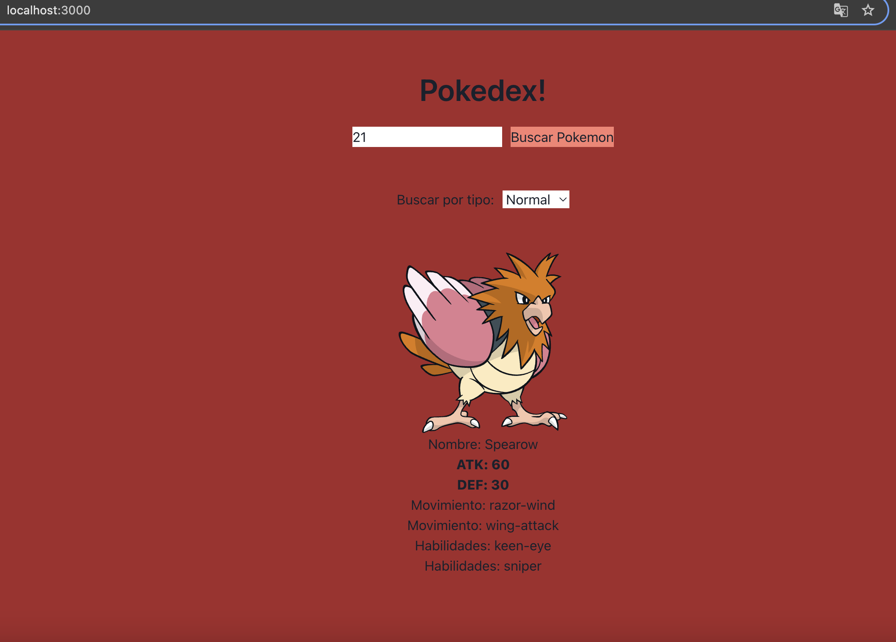
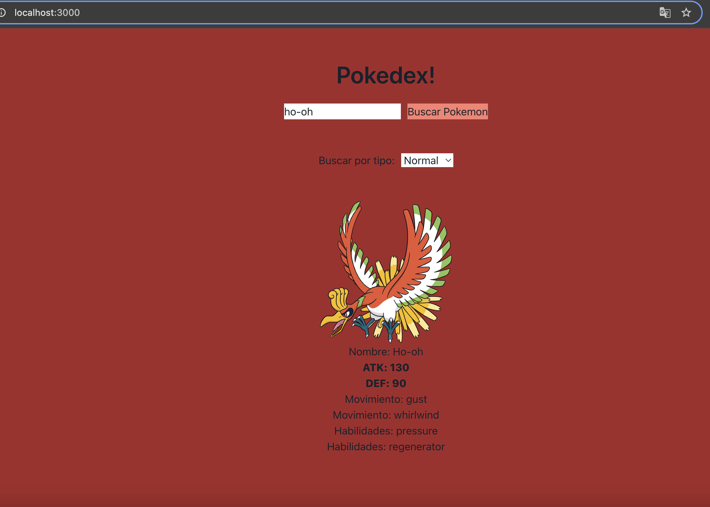
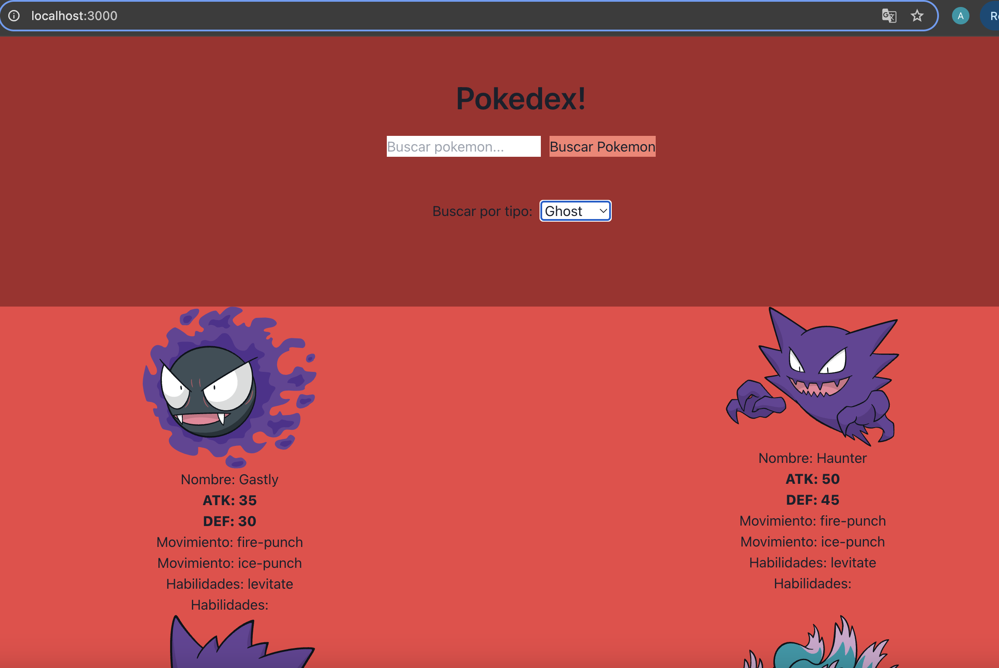

Pokedex es un proyecto de [Next.js](https://nextjs.org) que fue creado usando [`create-next-app`](https://nextjs.org/docs/app/api-reference/cli/create-next-app).

## Inicio

Descargar el proyecto y cambiarse a la rama develop:

```bash
git clone https://github.com/Alexrzreyes/pokedex.git
git checkout develop
```

Una vez en la rama develop, instalar las dependencias:
```bash
npm i
```

Una vez terminadas de instalar, ya se puede ejecutar el proyecto en local usando:

```bash
npm run dev
```

Abrir [http://localhost:3000](http://localhost:3000) con el navegador para ver la aplicación.

## Ejemplo de búsqueda por número



## Ejemplo de búsqueda por nombre



## Ejemplo de búsqueda por tipo

